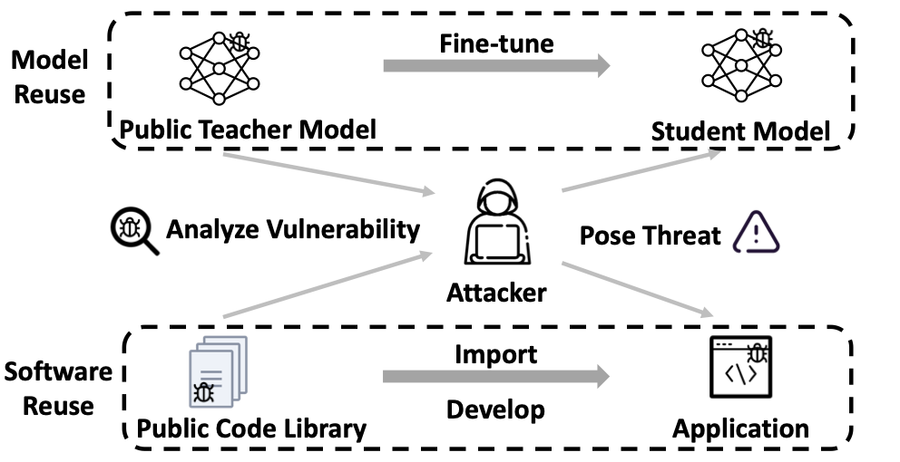

# ReMoS: Reducing Defect Inheritance in Transfer Learning via Relevant Model Slicing

This is the artifact for the ICSE 2022 paper ``ReMoS: Reducing Defect Inheritance in Transfer Learning via Relevant Model Slicing''. 

Transfer learning is a popular software reuse technique in the deep learning community that enables developers to build custom models (students) based on sophisticated pretrained models (teachers). However, like vulnerability inheritance in traditional software reuse, some defects in the teacher model may also be inherited by students, such as well-known adversarial vulnerabilities and backdoors. Reducing such defects is challenging since the student is unaware of how the teacher is trained and/or attacked. 
In this paper, we propose ReMoS, a relevant model slicing technique to reduce defect inheritance during transfer learning while retaining useful knowledge from the teacher model. Specifically, ReMoS computes a model slice (a subset of model weights) that is relevant to the student task based on the neuron coverage information obtained by profiling the teacher model on the student task. 
Only the relevant slice is used to fine-tune the student model, while the irrelevant weights are retrained from scratch to minimize the risk of inheriting defects.
Our experiments on seven DNN defects, four DNN models, and eight datasets demonstrate that ReMoS can reduce inherited defects effectively (by 63\% to 86\% for CV tasks and by 40\% to 61\% for NLP tasks) and efficiently with minimal sacrifice of accuracy (3\% on average). 
The instructions are in the instructions.md.